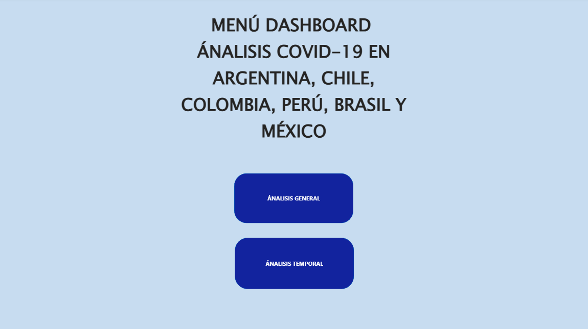
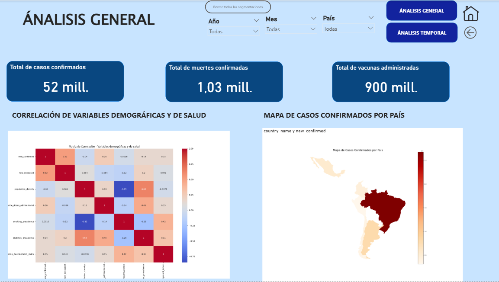

# Covid19 in Latinamerica

Analysis of COVID-19 pandemic data in selected Latin American countries using **Python** and **Power BI**.  
The project focuses on data cleaning, transformation, statistical exploration, visualization, and the creation of interactive dashboards.

---

## 📊 Project Overview
This repository contains a complete analysis of COVID-19 data for six Latin American countries:
**Argentina, Brazil, Chile, Colombia, Mexico, and Peru**.  
The analysis includes:

- Data cleaning and preprocessing with **Python (Pandas, NumPy)**.
- Statistical description of key variables (cases, deaths, vaccination).
- Correlation analysis and demographic/health factor comparisons.
- Visualization with **Matplotlib** and **Seaborn**.
- Geographic mapping with **GeoPandas**.
- Interactive dashboards with **Power BI**.

---

## 🗂 Repository Structure
├── code/ # Python scripts for data processing and visualization
├── data/ # Processed datasets
├── power_bi/ # Power BI dashboards and reports
└── README.md # Project documentation

yaml
Copiar código

---

## ⚙️ Requirements
To run the Python scripts, install the following libraries:

```bash
pip install pandas numpy matplotlib seaborn geopandas
```

## 🔍 Main Steps
Data Collection & Cleaning

Selection of countries of interest.

Handling missing values and irrelevant variables.

Export of cleaned dataset for further analysis.

Exploratory Data Analysis

Summary statistics (mean, median, variance, etc.).

Histograms, violin plots, and bar charts per country.

Correlation matrices for health, demographic, and climate factors.

Visualization

Scatter plots: temperature vs. cases/deaths.

Vaccination coverage vs. new cases per capita.

Distribution of population by age groups.

Choropleth maps of confirmed cases by country.

## Dashboard (Power BI)

Interactive panels with confirmed cases, deaths, vaccination, and demographic insights.




## 📌 Results & Insights
Significant differences in infection and mortality rates across countries.

Vaccination per capita correlates negatively with new confirmed cases.

Demographic variables (age structure, density) show varying impacts on spread and mortality.

Visual dashboards provide a clearer comparison of trends over time.


## 📄 License
This project is licensed under the MIT License – you are free to use, modify, and distribute it with proper attribution.
